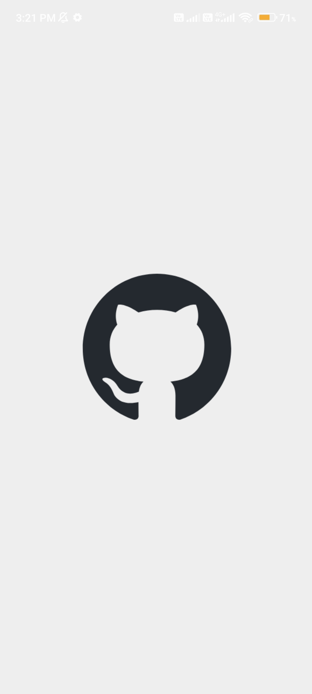
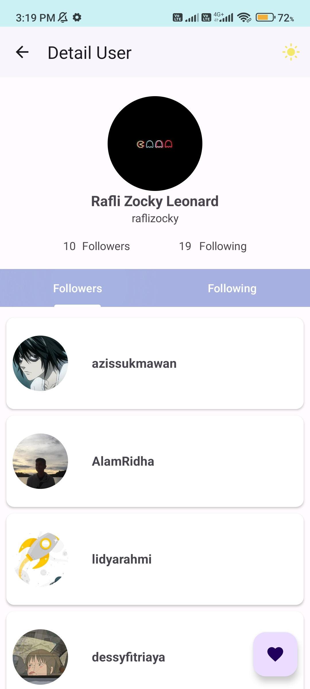
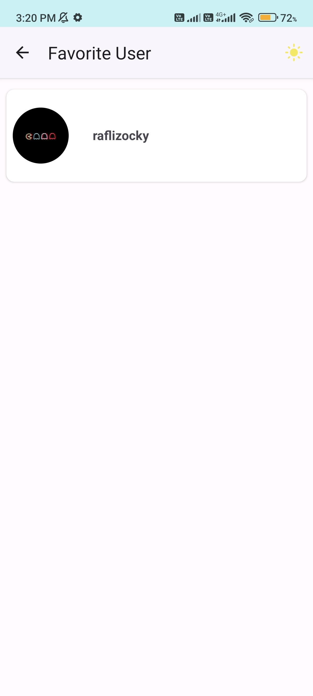
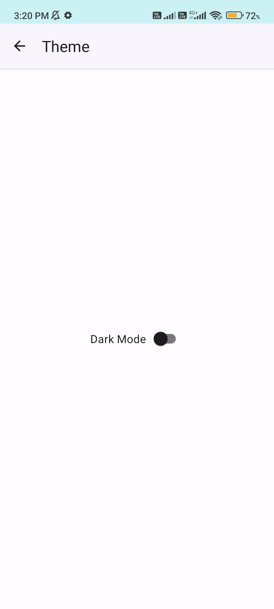
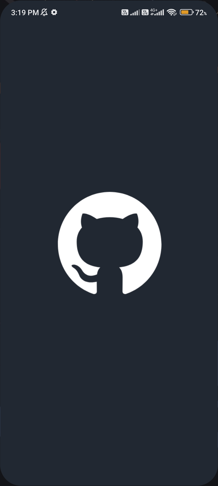
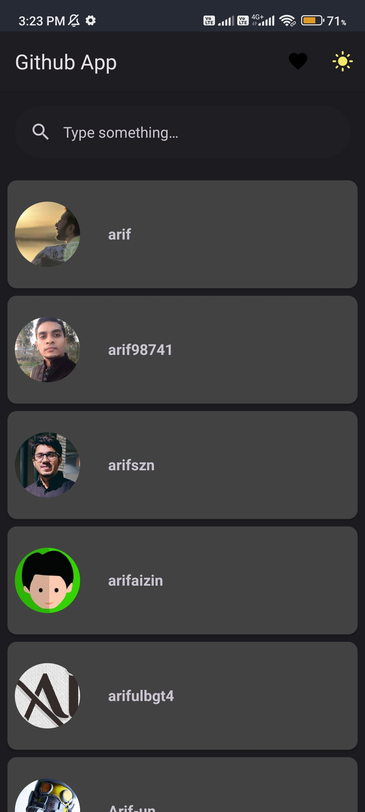
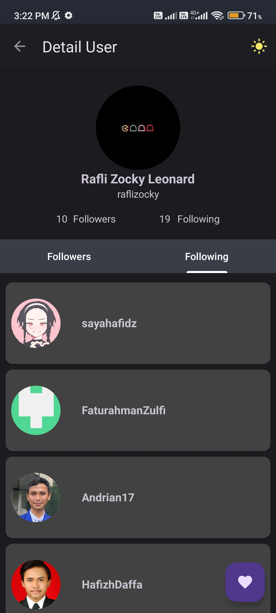
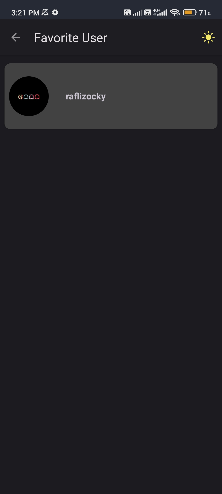

# github-app

github-app is an Android application that leverages fundamental Android components and libraries, including Fragments and Retrofit, to display a list of users on [github.com](https://github.com/) through the [GitHub REST API](https://docs.github.com/en/rest). For a comprehensive understanding of the components and libraries used, refer to the code.

---

## Installation
Download and install beta version [here](https://github.com/raflizocky/history-app/releases/download/v1.0-beta/app-debug.apk)

---

## Demo    
<h3 align="center"> Light Mode </h3>

    
    
    
    
   
    

<h3 align="center"> Dark Mode </h3>

    
    
    
    
   
    

## Pull Requests
Feel free to contribute to this repository by creating pull requests to add new features or demonstrate library usage.

## Support Me
> Just **star** or **fork** this repository and follow my GitHub. Your support means a lot!
